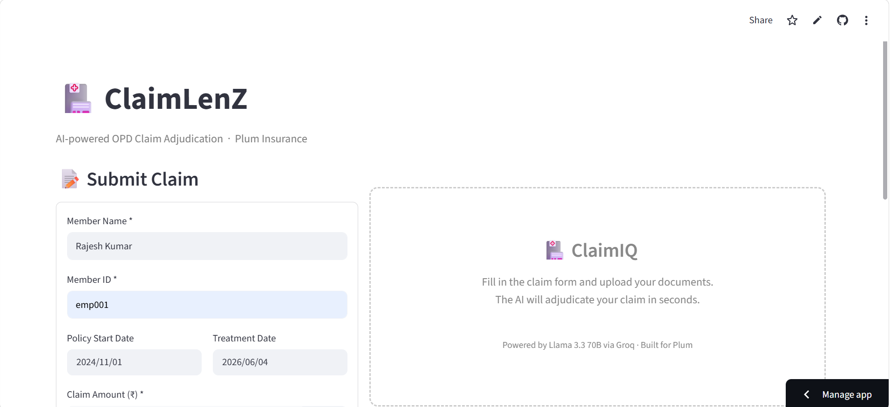
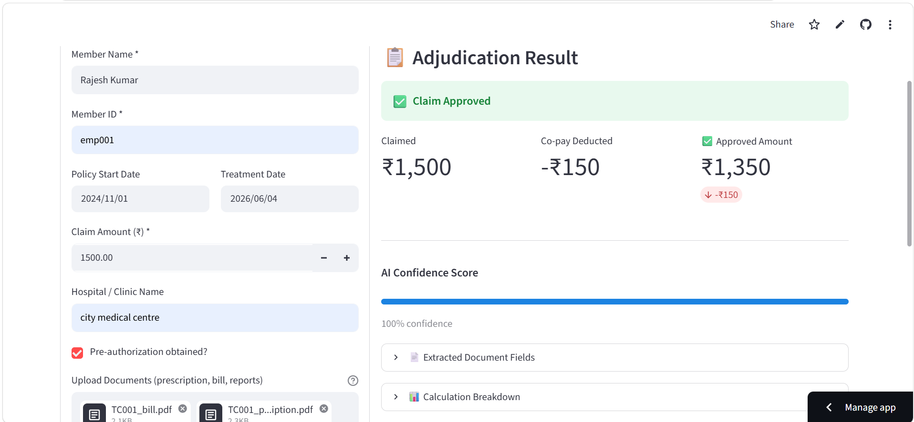
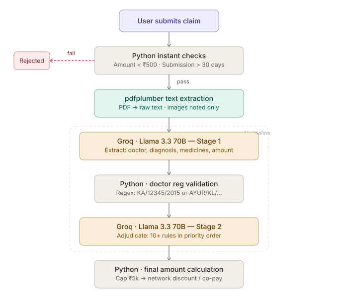
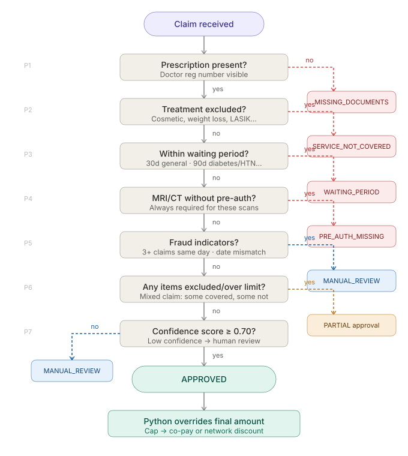
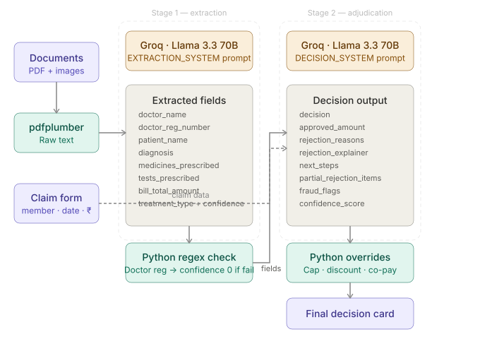

# 🏥 ClaimLenZ — OPD Claim Adjudication Tool

> AI-powered insurance claim processing built as part of Plum's AI Automation Engineer intern assignment.


**Live demo:** [claimlenz-for-plum-by-siva.streamlit.app](https://claimlenz-for-plum-by-siva.streamlit.app)

---

## 📸 App Preview

| Claim Form | Adjudication Result |
|---|---|
|  |  |

---

## ✨ Features

- 📄 **PDF Document Parsing** — Extracts text from prescriptions and bills via pdfplumber
- 🤖 **Two-Stage LLM Pipeline** — Stage 1 extracts structured fields, Stage 2 adjudicates with 10+ policy rules
- 🛡️ **Deterministic Rule Engine** — Python enforces all financial limits; LLM never touches numbers that affect payout
- 🏥 **Network Hospital Detection** — Auto-applies 20% discount for Apollo, Fortis, Max, Manipal, Narayana
- ⏳ **Waiting Period Enforcement** — Diabetes (90d), hypertension (90d), pre-existing (365d), maternity (270d)
- 🚨 **Fraud Detection** — Flags suspicious patterns for manual review instead of auto-rejecting
- 📊 **Confidence Scoring** — Decisions below 0.70 confidence auto-route to human review
- 🧾 **Session History** — Tracks all claims processed in the current session

---

## 🏗️ System Architecture



The app runs as a single Streamlit process. There is no separate backend server — `llm_client.py` is a Python module called directly from `app.py`. The only outbound HTTP call is from the Groq SDK to Groq's inference API.

---

## 🔄 Adjudication Decision Flow

Checks run in strict priority order. The moment any check fails, the claim is rejected and no further checks run.



---

## 🤖 Two-Stage LLM Pipeline

Stage 1 extracts structured data. Stage 2 adjudicates using that data plus claim form inputs. Financial calculations (cap, co-pay, network discount) are **always done in Python** — the LLM never outputs a number that directly affects payout. This eliminates hallucination risk on monetary values.



---

## 🧪 Test Cases

| ID | Scenario | Claimed | Expected Decision | Approved |
|----|----------|---------|-------------------|----------|
| TC001 | Viral fever — all docs valid | ₹1,500 | ✅ APPROVED | ₹1,350 |
| TC002 | Root canal + teeth whitening | ₹12,000 | ⚠️ PARTIAL | ₹8,000 |
| TC003 | Gastroenteritis — bill over per-claim cap | ₹7,500 | ⚠️ PARTIAL | ₹4,500 |
| TC004 | No prescription uploaded | ₹2,000 | ❌ REJECTED | ₹0 |
| TC005 | Diabetes — day 44 of policy (90d wait) | ₹3,000 | ❌ REJECTED | ₹0 |
| TC006 | Ayurvedic Panchakarma therapy | ₹4,000 | ✅ APPROVED | ₹4,000 |
| TC007 | MRI scan — no pre-authorization | ₹15,000 | ❌ REJECTED | ₹0 |
| TC008 | 3 claims on same day (fraud flag) | ₹4,800 | 🔍 MANUAL REVIEW | — |
| TC009 | Weight loss / bariatric — excluded | ₹8,000 | ❌ REJECTED | ₹0 |
| TC010 | Apollo Hospital (network) — cashless | ₹4,500 | ✅ APPROVED | ₹3,600 |

Sample PDFs for TC001, TC002, TC005, TC009, TC010 are in `/Sample_docs`.

---

## 📋 Policy Rules Summary

| Rule | Value |
|------|-------|
| Per-claim cap | ₹5,000 |
| Annual limit | ₹50,000 |
| Minimum claim | ₹500 |
| Submission window | 30 days from treatment date |
| Non-network co-pay | 10% |
| Network discount | 20% (Apollo, Fortis, Max, Manipal, Narayana) |
| Consultation sub-limit | ₹2,000 |
| Pharmacy sub-limit | ₹15,000 |
| Diagnostics sub-limit | ₹10,000 |
| Dental sub-limit | ₹10,000 |
| Alternative medicine sub-limit | ₹8,000 |

**Waiting periods** — General: 30d · Diabetes/Hypertension: 90d · Maternity: 270d · Pre-existing: 365d · Joint replacement: 730d

**Always excluded** — Cosmetic procedures, LASIK, weight loss/bariatric, IVF, HIV/AIDS, vitamins (unless deficiency diagnosed), self-inflicted injuries, adventure sports

**Pre-auth required** — MRI and CT scans, always, regardless of amount

---

## 🛠️ Tech Stack

| Layer | Technology | Purpose |
|-------|-----------|---------|
| UI & Orchestration | Streamlit | Form, file upload, result rendering |
| LLM | Groq — LLaMA 3.3 70B Versatile | Document extraction + adjudication |
| PDF parsing | pdfplumber | Text extraction from medical documents |
| Rule engine | Python (deterministic) | Financial caps, co-pay, waiting periods |
| Environment | python-dotenv | API key management |
| Deployment | Streamlit Cloud | Public hosting |

---

## 📁 Project Structure

```
ClaimLenZ/
├── app.py              # Streamlit UI + orchestration (414 lines)
├── llm_client.py       # Groq API calls — two-stage pipeline
├── prompts.py          # System prompts + user message builders
├── requirements.txt    # streamlit · groq · pdfplumber · python-dotenv
├── .env.example        # Environment variable template
├── Sample_docs/        # Test PDFs for TC001, TC002, TC005, TC009, TC010
└── docs/               # Screenshots + architecture diagrams
```

---

## 🚀 Local Setup

```bash
# 1. Clone the repo
git clone https://github.com/sivamani-muraboyina/ClaimLenZ.git
cd ClaimLenZ

# 2. Create virtual environment
python -m venv venv
source venv/bin/activate       # Mac/Linux
venv\Scripts\activate          # Windows

# 3. Install dependencies
pip install -r requirements.txt

# 4. Add your Groq API key
cp .env.example .env
# Edit .env and set: GROQ_API_KEY=your_key_here

# 5. Run
streamlit run app.py
```

Get a free Groq API key at [console.groq.com](https://console.groq.com) — no credit card required.

---

## ☁️ Deployment (Streamlit Cloud)

1. Push repo to GitHub
2. Go to [share.streamlit.io](https://share.streamlit.io) → New app
3. Select repo + `app.py` as the main file
4. Under **Secrets**, add:
   ```toml
   GROQ_API_KEY = "your_key_here"
   ```
5. Deploy — live in ~60 seconds

---

## 📐 Assumptions

- **No persistent database** — annual limit is not tracked across sessions; a database (PostgreSQL/Supabase) would be needed for production
- **PDF text only** — image uploads (JPG/PNG) are accepted but text extraction only works on text-based PDFs, not scanned images (OCR not implemented)
- **Per-claim cap triggers partial, not rejection** — a ₹7,500 claim is partially approved up to ₹5,000 rather than fully rejected
- **Network discount and co-pay are mutually exclusive** — network hospitals get 20% discount; all others get 10% co-pay
- **AYUSH doctor registration accepted** — format `AYUR/STATE/NUMBER/YEAR` alongside standard `STATE/NUMBER/YEAR`
- **Fraud detection routes to manual review** — never auto-rejects; a human should make the final call on suspicious patterns
- **Confidence threshold is 0.70** — decisions below this are automatically sent for human review regardless of other checks

---

## 🔮 Potential Improvements

- **OCR for scanned documents** — Tesseract or Google Vision API to handle image-based prescriptions
- **Persistent annual limit tracking** — PostgreSQL or Supabase to track YTD claims per member
- **Appeals workflow** — human-in-the-loop review queue for MANUAL_REVIEW decisions
- **Multi-language support** — Hindi, Telugu, Tamil prescriptions via multilingual LLM prompting
- **Admin panel** — policy configuration (limits, exclusions, waiting periods) without touching code
- **Confidence calibration** — fine-tune thresholds based on actual adjudication outcomes

---

## 📄 License

MIT — see [LICENSE](LICENSE) for details.
